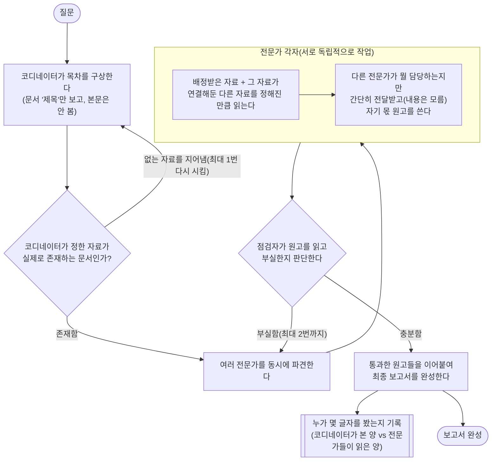
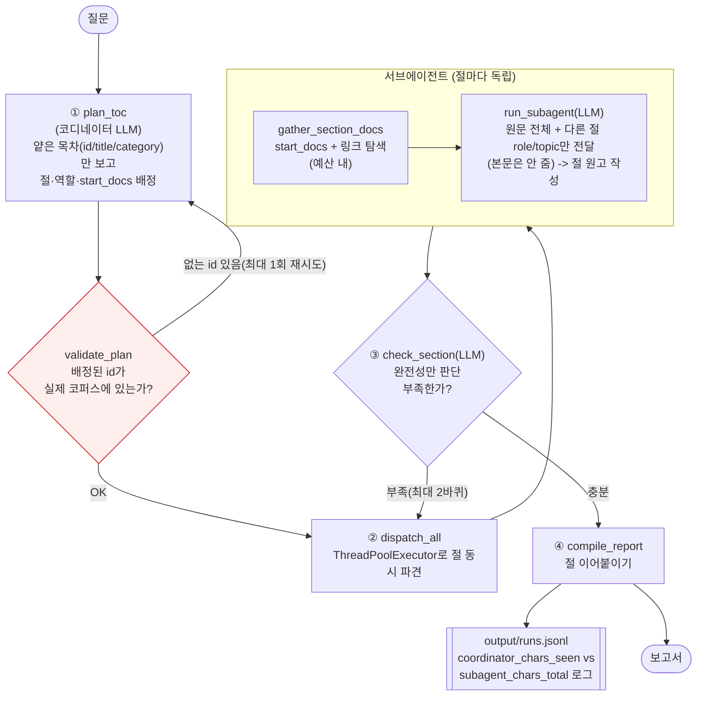

# REPORT — eaT 제도 이슈 딥리서처

## 1. 주제와 코퍼스

**주제**: 공공급식통합플랫폼을 둘러싼 제도 이슈의 연혁을 여러 절로 나눠 조사하는 딥리서처. 이 주제는 국정감사 지적 → 정책(시행령개정) 대응 → 언론 후속보도 → 다음 국감 예고로 이어지는 **자연스러운 인용 사슬**이 이미 존재해 링크 구조 확보가 가장 쉬웠고, 복직 후 실제 업무(제도 개선 보고서 작성)에도 재활용 가능하다는 점에서 선택했다.

**코퍼스**: 33건 (`data/corpus.json`). 웹 검색·수집 30건(뉴스·지자체 발표·aT 공식 게시물) + 로컬에 이미 보유하고 있던
eaT 자체 공급업체 심사기준 PDF 3건(`k1~k3`). title+summary 합계 10,973자 — 서브에이전트 모델을 소형 로컬 모델(가정:
컨텍스트 ~4096토큰≈국문 3,000자)로 잡았을 때, 한 에이전트가 한 턴에 코퍼스 전체를 읽기엔 이미 벅찬 분량이다. 카테고리는
8개(HIST 10 · CASE 5 · HYGIENE 4 · POLICY 4 · INFRA 3 · CRITERIA 3 · FRAUD 2 · AUDIT2026 2)이며, 문서 간 `links`는
사람이 사실관계(같은 사건의 후속보도, 인용 관계, 시간적 선후관계)를 직접 판단해 부여했다.

**원문 미복사 원칙**: 저작권상 기사 원문을 그대로 긁어오지 않고, 사실관계를 확인한 뒤 직접 재구성한 요약만 코퍼스에
담았다. 이 때문에 초기 버전(6,129자)은 실제 모델 컨텍스트를 못 넘길 만큼 얇아서, 이미 추출해둔 세부 수치를 더 활용해
문서당 평균 180자 → 332자로 보강했다(§7 회고에서 다시 다룬다).

## 2. 질문 세트

`data/questions.json`에 10건. 정답표는 없고, 문항마다 "왜 나눌 만한가"를 한 줄로 남겼다.
- **single(2건)**: 법령 세부 제재기간(q1), 인천 특사경 적발 내용(q2) — 답이 단일 문서군에 그대로 있어 분업이 오히려
  손해인 사례를 의도적으로 포함(이 구조를 쓰면 안 되는 경우를 보이는 것도 과제의 일부).
- **multi_branch(5건)**: 자체 심사기준 vs 실제 위반 실태의 간극(q3), 정책 이후에도 재계약이 지속되는 이유(q4),
  성장과 부실의 양립 가능성(q5), 제재 강화와 처벌 수준의 시기별 교차대조(q8), 인프라 개편과 국감·재계약 논란의
  인과관계 유무(q9, 있는 사실이 아니라 **없는 인과관계를 지어내지 않는지** 시험하는 질문).
- **entity_tracking(3건)**: 위장업체 수법의 연대기(q6), 플랫폼 자체의 확장사(q7), 2025 국감→2026 정책·후속국감으로
  이어지는 이슈 하나의 1년치 흐름(q10, 코퍼스 전체를 가로지르는 가장 복합적인 질문).

## 3. 분업 설계

**역할 명단(8개, `config.json`)**: 코퍼스의 8개 카테고리에 1:1 대응하는 고정 역할(HIST/FRAUD/HYGIENE/CASE/POLICY/
INFRA/AUDIT2026/CRITERIA). 코디네이터는 질문마다 이 중 **관련 있는 것만** 골라 쓴다 — 절 수 상한은 5개이고, 실제로
q1·q2류 질문에서는 코디네이터가 절을 1개만 만들도록 프롬프트로 강제했다(내용 단위 분업 원칙: 형식으로 나누면 전원이
같은 자료를 읽게 되므로 금지).

| role_id | 역할 | 홈 카테고리(기본 시작자료) |
|---|---|---|
| HIST | 연혁·확장 분석가 | h0~h9 |
| FRAUD | 불공정행위·국감 분석가 | f1, f2 |
| HYGIENE | 위생·재계약 실태 분석가 | y1~y4 |
| CASE | 개별 적발사례 조사관 | c1~c5 |
| POLICY | 정책·법령 분석가 | p1~p4 |
| INFRA | 인프라 분석가 | i1~i3 |
| AUDIT2026 | 차기 국감 전망 분석가 | a1, a2 |
| CRITERIA | 심사기준 대조 분석가 | k1~k3 |

**배정 규칙**: 코디네이터는 `{id, title, category}`만 있는 얕은 목차를 보고 절마다 `start_docs`(문서 id 배열)를
배정한다. 코드가 이 id들이 실제 코퍼스에 존재하는지 검사하고(`validate_plan`), 존재하지 않는 id를 지어냈으면 그
사실만 알려 1회 재계획시킨다 — 실제로 이번 실행들에서는 `plan_id_hallucination_count`가 전부 0으로, 이 문제는
관측되지 않았다.

**예산(`config.json/budget`)**: `section_budget_docs=4`(링크 따라 추가로 열 수 있는 문서 수), `section_budget_chars
=4000`(절 하나의 총 읽기 글자수 상한), `max_sections_per_question=5`, `max_revision_rounds=2`.

**격리 증명**: 코디네이터에게는 요약(summary) 없는 얕은 목차만 주고, 서브에이전트에게는 자기 절의 원문 전체(+ 링크
탐색분)를 준다. 이 둘이 "본" 글자 수를 각각 `coordinator_chars_seen` / `subagent_chars_total`로 따로 세어
`output/runs.jsonl`에 남긴다. 서브에이전트에게는 다른 절의 **역할명+한줄주제만** 알려주고(`peer_awareness_chars`),
본문은 주지 않는다.

## 4. 지표 (정답표도 판정 모델도 쓰지 않는다)

전부 "글에 남은 인용 표시([id])"와 "로그에 남은 실제 읽기 기록"만 대조해서 계산한다(`metrics.py`).

| 구분 | 지표 | 장치(무엇을 보는 신호인가) |
|---|---|---|
| ALARM(0이어야 함) | invalid_citation_rate | 코퍼스에 아예 없는 id를 인용 = 완전한 지어냄 |
| ALARM | unread_citation_rate | 인용은 있지만 자기가 실제로 읽지 않은 문서를 인용 = 근거성 위반 |
| ALARM | plan_id_hallucination_count | 기획 단계에서 존재하지 않는 id를 배정한 횟수 |
| SIGNAL | isolation_ratio | 코디네이터가 본 글자수/서브에이전트가 읽은 글자수 합 — 격리 설계 작동 여부 |
| SIGNAL | citation_density | 100자당 인용 개수 — 근거 촘촘함 |
| SIGNAL | assigned_doc_utilization | 배정된 시작자료 중 실제 인용 비율 — 배정의 적절성 |
| SIGNAL | link_traversal_ratio | 링크 따라 추가로 읽은 문서/예산 — 탐색 장치 실사용률 |
| SIGNAL | cross_section_overlap | 절끼리 읽은 문서의 자카드 유사도 — 내용기준 분할 여부(높으면 형식분할 의심) |
| SIGNAL | revision_rate | 재파견된 절 비율 — 점검 단계의 실제 판별력 |

문체·감성처럼 "한 줄로 설명 안 되는" 지표는 후보에 있었으나 제외했다.

## 5. 파이프라인 구조도

### 쉬운 버전 (용어 없이 흐름만)

### 자세한 버전 (코드 함수명 포함)

## 6. 데모 설계 (`app.py`, Streamlit)

신경 쓴 부분:
- **숫자만 보여주지 않는다**: 절마다 "배정된 시작자료"와 "실제로 읽은 자료(링크 탐색분은 🔗 표시)"를 나란히 두 열로
  보여주고, 그 아래 실제 원고를 펼쳐볼 수 있게 했다 — 이 프로젝트의 핵심이 "숫자"가 아니라 "누가 뭘 읽고 뭘 썼는가"이기
  때문이다.
- **격리를 첫 화면에서 바로 보여준다**: 코디네이터가 본 글자수/서브에이전트가 읽은 글자수/코퍼스 전체 글자수 세 개를
  metric 카드로 맨 위에 배치하고, 비율 해석 문장을 캡션으로 붙였다.
- **재파견된 절은 배지로 표시**: 점검(③)에서 부족 판정을 받아 다시 쓴 절에 🔁 표시를 달아, 점검 장치가 실제로
  작동했는지 한눈에 보이게 했다.
- **실험용 장치 on/off를 사이드바에 노출**: "새 질문 실행" 모드에서 4개 장치(isolation/link_traversal/peer_awareness/
  revision_check) 체크박스를 그대로 UI에 얹어, 사용자가 직접 스위치를 꺼보며 결과가 어떻게 달라지는지 확인할 수 있게
  했다.
- **지난 실행 보기**: `output/runs.jsonl`에 쌓인 모든 실행(기본·소거·대조군·재현실험 포함)을 드롭다운으로 골라 다시
  열어볼 수 있게 해서, 매번 API를 다시 부르지 않고도 이전 결과를 비교할 수 있다.

로컬에서 `streamlit run app.py`로 직접 확인했다(CRITERIA 절을 펼쳐 배정 문서(k1·k2·k3)와 실제 읽은 문서(k1·k2·k3 +
링크로 추가 탐색된 h7)가 구분되어 표시되는 것, 격리 지표 카드(3,689자/8,028자/10,973자)가 정상 렌더링되는 것을
확인함).

## 7. 결과물 직접 비교 (기본 · 장치 하나 끈 것 · 대조군)

같은 질문(q3: "eaT가 자평한 관리체계와 실제 위반 실태 사이의 간극은?")으로 세 편을 만들어 나란히 읽었다.

**기본(full) vs 혼자 하는 대조군(baseline)** — 가장 뚜렷한 차이가 여기서 나왔다. 대조군에는 코퍼스 전체(10,973자)와
같은 모델을, 실제 멀티에이전트가 소비한 총 예산(8,028자)과 같거나 더 넉넉하게 줬다(예산이 코퍼스보다 커서 대조군은
전혀 굶지 않았다 — `budget_chars_given=8028 > budget_chars_used=7954`, 즉 코퍼스 전체를 다 읽고도 예산이 남았다).
그런데도 `assigned_doc_utilization`이 full 0.89 vs baseline 0.125로 나올 만큼, 대조군은 실제로는 h7·f1·f2 **단 3개
문서만** 반복 인용하며 맴돌았고 k1~k3(심사기준 원문)·y1~y4(재계약 실태)·c4·c5(선례 사례)는 언급만 하고 근거로 쓰지
않았다. 반면 full은 9개 서로 다른 문서를 인용해 3단(자체 주장 → 국감 실태 → 재계약 실태)으로 쌓았다. **자료를 안
줘서가 아니라(똑같이 다 줬다), 절을 강제로 나누지 않으니 눈에 띄는 자료에 쏠려 나머지를 깊이 못 판 것** — 이번
실험에서 이 구조가 "값을 한" 가장 확실한 지점이다.

**기본 vs peer_awareness 끈 것** — 처음 1회 비교에서는 "peer_awareness가 있어야 FRAUD 절이 링크를 따라 POLICY
계열(p1)까지 인용한다"는 패턴이 보였다. 그런데 **같은 조건으로 3회 더 반복**(`ablation_repro.py`, 총 4회)했더니
재현되지 않았다 — full 4회 중 3회, no_peer_awareness 4회 중 2회가 p1을 인용해 방향은 비슷해 보이지만 4회차에서
역전됐다. **표본이 너무 작아 스위치 효과와 API 실행별 비결정성(temperature=0이어도 완전히 결정적이지 않다)을
구분할 수 없다는 결론을 내리고, 이 가설은 기각했다.** 한 번 돌린 결과로 방향을 단정하면 안 된다는 원칙이 이
프로젝트에서도 실제로 한 번 걸린 사례로 남긴다.

**인용 자리 대조(사람만 잡을 수 있는 부분)**: full.md에서 [c4]→2018 대전 위장업체 사건, [c5]→2016 경남 담합 사건,
[y3]→한병도 의원 발언 원문 세 곳을 코퍼스 원문과 직접 대조했고, 이번 점검에서는 엉뚱한 문장에 갖다 붙인 사례를
찾지 못했다(다만 3곳만 표본 점검한 것이라 전수 검증은 아니다).

## 8. 프로젝트 회고

**가장 공들인 부분**: 저작권을 지키면서도(원문 그대로 복사 금지) 코퍼스가 실제로 "모델 창을 넘는" 분량이 되도록
만드는 균형점 찾기. 초안(6,129자)이 너무 얇다는 걸 스스로 검증(`python3 -c "..."`로 총 글자수를 직접 세어)해서
확인했고, 이미 웹에서 확인한 세부 수치를 더 끌어와 요약을 2배 가까이(10,973자) 보강했다. 이 과정에서 한국어
겹낫표(「」)로 인용구를 표기하지 않고 ASCII 큰따옴표(`"`)를 그대로 썼다가 JSON이 4번이나 깨지는 실수를 했는데,
`python3 -c "json.load(...)"` 검증을 매번 돌려 잡아냈다 — 지표 못지않게 "만든 파일이 실제로 유효한가"부터 코드로
확인하는 습관이 중요하다는 걸 다시 확인했다.

**막혔던 부분과 해결**: (1) 인용 정규식이 `[id]`만 잡고 `[ id ]`(공백 포함)는 못 잡아 `citation_density`가 0으로
나온 버그 — 실제 LLM 출력이 두 형식을 섞어 썼다는 걸 report를 직접 읽고서야 발견했고, 정규식에 공백 허용을 추가해
고쳤다. (2) baseline의 `isolation_ratio`가 `coordinator_chars_seen=None`이라 0으로 나누기 오류가 났는데, 이건
애초에 "혼자 하는 대조군에는 코디네이터-서브에이전트 분리라는 개념 자체가 없다"는 사실을 코드가 인정하지 않고
억지로 계산하려 했던 게 원인이었다 — None을 반환하도록 고쳤다.

**향후 보완하고 싶은 점**:
1. `isolation_ratio`가 0.46으로, "코디네이터는 목차만 본다"는 설계 의도에 비해 그렇게 작은 비율은 아니다 — 얕은
   목차 자체(제목+카테고리, 33건)가 이미 3,689자나 되기 때문이다. 제목을 더 압축하거나 카테고리 단위로 묶어
   보여주는 방식으로 이 비율을 더 낮출 여지가 있다.
2. peer_awareness 효과를 4회만 반복했는데, 표본을 늘리거나(예: 10회) 다른 질문에서도 반복해봐야 "이 장치가
   정말 아무 효과가 없다"고 확정할 수 있다 — 지금은 "이 표본으로는 판단 불가"까지만 말할 수 있다.
3. `cross_section_overlap`이 두 실행(full/ablated)에서 완전히 같은 값(0.186)으로 나왔는데, 이는 peer_awareness가
   docs_read 자체에는 영향을 주지 않고 서술 방식에만 영향을 줄 가능성을 시사한다 — 문서 집합이 아니라 "같은 사실을
   반복 서술하는지"까지 보는 지표(예: 절 간 n-gram 중복률)를 추가하면 이 장치의 진짜 효과를 더 잘 잡을 수 있을 것
   같다.
4. 코퍼스가 국내 뉴스 33건에 한정돼 있어, 시점상 2026년 9월 이후 실제 국정감사(10월 7일 시작 예정)에서 나올
   내용은 반영돼 있지 않다 — 국감이 끝난 뒤 코퍼스를 갱신하면 q10(코퍼스 전체를 가로지르는 질문)의 답이 실제로
   어떻게 달라지는지 비교해보는 것도 의미 있을 것 같다.
